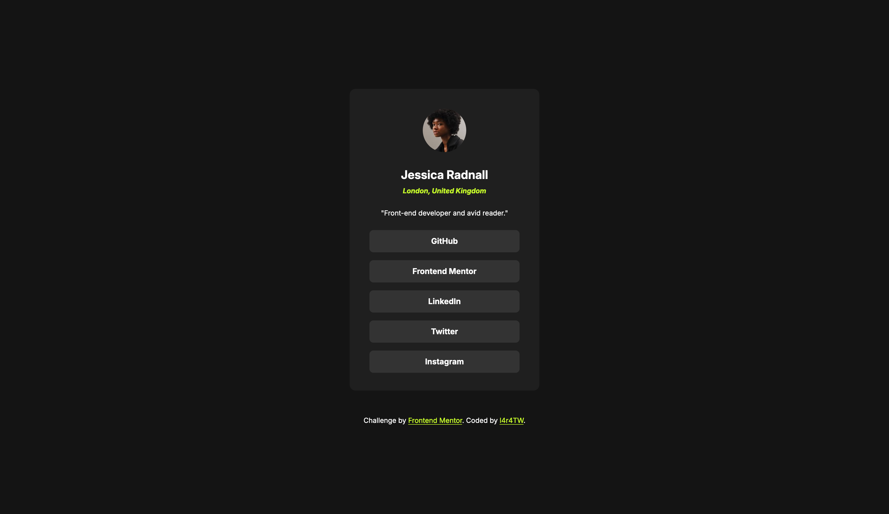

# Frontend Mentor - Social links profile solution

This is a solution to the [Social links profile challenge on Frontend Mentor](https://www.frontendmentor.io/challenges/social-links-profile-UG32l9m6dQ). Frontend Mentor challenges help you improve your coding skills by building realistic projects.

## Table of contents

- [Overview](#overview)
  - [The challenge](#the-challenge)
  - [Screenshot](#screenshot)
  - [Links](#links)
- [My process](#my-process)
  - [Built with](#built-with)
  - [What I learned](#what-i-learned)
  - [Continued development](#continued-development)
  - [Useful resources](#useful-resources)
- [Author](#author)
- [Acknowledgments](#acknowledgments)

## Overview

### The challenge

Users should be able to:

- See hover and focus states for all interactive elements on the page

### Screenshot



### Links

- Solution URL: [Frontend Mentor Solution](https://www.frontendmentor.io/solutions/static-social-links-profile-1sf8M3R6mk)
- Live Site URL: [GitHub Pages Live Site URL](https://l4r4tw.github.io/Social-links-profile/)

## My process

### Built with

- Semantic HTML5 markup
- CSS custom properties
- Flexbox

### What I learned

- The basic usage of CSS variables

```css
:root {
  --grey-900: #141414;
  --grey-800: #1f1f1f;
  --grey-700: #333333;
  --green: #c4f82a;
  --white: #ffffff;
}
```

- The basics of semantic HTML
- Some easy javascript DOM manipulation

```javascript
document.addEventListener("keydown", function (event) {
  // List of buttons
  const buttons = document.querySelectorAll(".button-link");

  // Get the index of the currently focused button
  const focusedButtonIndex = Array.from(buttons).indexOf(
    document.activeElement
  );

  if (event.key === "ArrowDown") {
    // Move to the next button (down arrow key)
    const nextIndex = (focusedButtonIndex + 1) % buttons.length;
    buttons[nextIndex].focus();
    event.preventDefault(); // Prevent default behavior (scrolling, etc.)
  } else if (event.key === "ArrowUp") {
    // Move to the previous button (up arrow key)
    const prevIndex =
      (focusedButtonIndex - 1 + buttons.length) % buttons.length;
    buttons[prevIndex].focus();
    event.preventDefault(); // Prevent default behavior
  }
});
```

### Continued development

In the future project I want to improve my responsive web design skills, because it's one of the most important topic. I'm also keen to use more JavaScript in the future projects.

### Useful resources

- [ChatGPT](https://chatgpt.com/) - Almost always gives me a easy to understand, good working answer, without judjing me like people on Stackoverflow <3
- [YouTube](https://www.youtube.com) - Thousands of useful and beginnerfriendly videos!

## Author

- Frontend Mentor - [@l4r4TW](https://www.frontendmentor.io/profile/L4r4TW)
- Twitter - [@l4r4TW](https://x.com/L4r4TW)
- LinkedIn - [bruno-banoczi-csernak](https://www.linkedin.com/in/bruno-banoczi-csernak/)

## Acknowledgments

As always, huge thanks for [@WebDevSimplified](https://www.youtube.com/@WebDevSimplified) for the best frontend videos!
